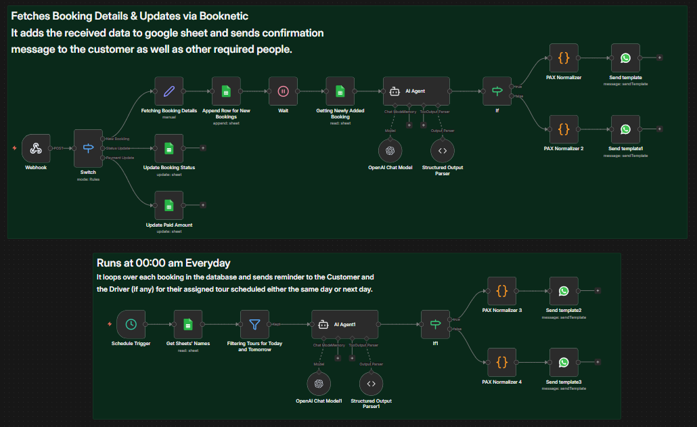

# Booknetic Sheet Automation (n8n)

An AI-powered automation workflow built in n8n that integrates Booknetic with Google Sheets and WhatsApp to automatically fetch booking details, update records, and send confirmations and scheduled reminders.

---

## 📌 Overview

This project connects **Booknetic, OpenAI, Google Sheets, and WhatsApp** to build a fully automated booking management and reminder system.

When a booking is created or updated in Booknetic:

- Booking details are fetched via webhook  
- Data is appended/updated in Google Sheets  
- Structured data is generated using AI  
- Confirmation messages are sent automatically  
- Payment status and amounts are synced  
- Daily reminder workflow runs for upcoming bookings  

The system ensures real-time booking tracking and proactive communication with customers and assigned staff.

---

## 🏗️ Workflow Architecture

This automation consists of **two main workflows**:

---

### 1️⃣ Real-Time Booking Processing (Webhook-Based)

Triggered whenever Booknetic sends booking or payment updates.

#### Main Components

- Webhook (Booknetic Trigger)
- Switch Node (Event Routing)
  - New Booking
  - Status Update
  - Payment Update
- Fetch Booking Details
- Google Sheets:
  - Append New Booking  
  - Update Booking Status  
  - Update Paid Amount  
  - Read Newly Added Booking  
- Wait Node (Data Sync Handling)
- AI Agent (OpenAI Chat Model)
- Structured Output Parser
- IF Node (Conditional Routing)
- Code Nodes:
  - PAX Normalizer  
  - Multi-recipient Handling  
- WhatsApp Send Template Nodes

---

### 2️⃣ Scheduled Reminder Workflow (Runs Daily at 00:00 AM)

Automatically sends reminders for upcoming tours.

#### Main Components

- Schedule Trigger (Daily at 00:00 AM)
- Google Sheets (Read All Bookings)
- Filter Node (Today & Tomorrow Tours)
- AI Agent (Message Structuring)
- Structured Output Parser
- IF Node (Driver Required Logic)
- Code Nodes (PAX Normalizer)
- WhatsApp Send Template Nodes

---

## 🔄 Workflow Visual

---

## 🧠 How It Works

### 1️⃣ Webhook Trigger (Booknetic → n8n)

Booknetic sends data to the webhook when:

- A new booking is created  
- Booking status changes  
- Payment amount is updated  

The Switch node routes each event type to the correct processing path.

---

### 2️⃣ New Booking Flow

When a new booking is received:

- Booking details are fetched  
- Data is appended to Google Sheets  
- System waits briefly to ensure sheet consistency  
- Newly added booking row is retrieved  
- AI Agent processes the data  
- Structured output is generated  
- PAX is normalized  
- Confirmation messages are sent to:
  - Customer  
  - Internal team / admin  
  - Other required stakeholders  

---

### 3️⃣ Status Update Flow

If booking status changes:

- Matching row is located in Google Sheets  
- Status column is updated automatically  

---

### 4️⃣ Payment Update Flow

If payment is made or updated:

- Paid amount is synced in the sheet  
- Financial tracking remains accurate  

---

### 5️⃣ AI Processing Layer

The AI Agent:

- Structures booking data  
- Formats message templates  
- Standardizes date/time  
- Handles numeric normalization  
- Generates clean output for messaging  

Structured Output Parser ensures reliable JSON-based formatting.

---

### 6️⃣ PAX Normalization Logic

Custom code nodes:

- Convert missing values (NA → 0)  
- Ensure numeric consistency  
- Standardize passenger count  
- Prepare structured message variables  

---

### 7️⃣ WhatsApp Confirmation System

After processing:

- Sends confirmation to customer  
- Sends notification to admin  
- Optionally sends notification to assigned driver  

All messages use predefined WhatsApp templates.

---

### 8️⃣ Daily Reminder Automation (00:00 AM)

Every day at midnight:

- All bookings are fetched from Google Sheets  
- Tours scheduled for:
  - Same day  
  - Next day  
- AI prepares structured reminder messages  
- If `driver_required = Yes` → Driver receives reminder  
- Customer always receives reminder  

This ensures no booking is missed.

---

## 🛠️ Tech Stack

- n8n (Workflow Automation)  
- Booknetic (WordPress Booking System)  
- OpenAI (Chat Model + Structured Output)  
- Google Sheets API  
- WhatsApp Business API  
- JavaScript (Code Nodes for normalization & routing)

---

## 🔐 Required Credentials

Configure the following inside n8n:

- Webhook URL configured inside Booknetic  
- OpenAI API Key  
- Google Sheets OAuth2 Credentials  
- WhatsApp Business API Credentials  

---

## ✅ Features

- Real-time booking processing  
- Webhook-based event routing  
- Automatic Google Sheet sync  
- Status and payment tracking  
- AI-based structured formatting  
- PAX normalization logic  
- Multi-recipient message routing  
- WhatsApp template confirmations  
- Conditional driver notifications  
- Daily automated reminders  
- Fully automated booking lifecycle management  

---

## 🎯 Use Cases

- Tour operators using Booknetic  
- Travel & activity businesses  
- Appointment-based service providers  
- WhatsApp-driven booking systems  
- Automation portfolio project  
- Internal booking management system  

---
